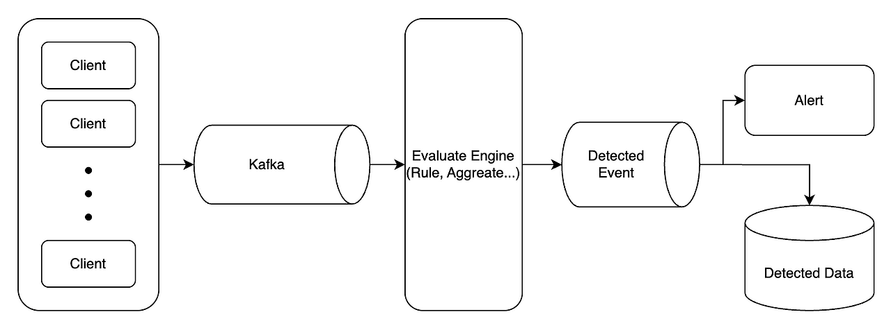

# FDS Demo (Fraud Detection System Demo)

이 프로젝트는 **Kafka Streams** 기반의 간단한 **Fraud Detection System(FDS) 데모**입니다.  
실시간으로 들어오는 **거래(Transaction)** 이벤트를 **정해진 Rule**로 평가하여, Rule에 저촉되는 경우 이를 **알림(Alerts) 토픽**으로 전송합니다.

---

## **프로젝트 구조**
- **Rule**: 거래를 평가하는 규칙. 인터페이스로 정의되어 있으며, 필요에 따라 구현 가능
- **Pipeline**: Rule을 적용하고 평가 흐름을 구성하는 인터페이스. 구현을 통해 파이프라인 구성 가능
- **RuleEvaluator**: 거래 이벤트를 받아 등록된 Rule을 평가하는 핵심 컴포넌트. Rule에 저촉되는 거래가 있으면 알림 토픽으로 이벤트 전달
- **Kafka Streams**: 거래 이벤트를 스트리밍 처리하여 Rule 평가 파이프라인과 알림 토픽으로 연결

---

## **서비스 실행**
### Kafka 실행
Docker를 이용하여 Kafka와 Zookeeper를 실행하며, 시작/종료용 `sh` 스크립트 제공

#### 시작
```bash
cd docker
./up-docker-compose.sh
```
#### 종료
```bash
cd docker
./down-docker-compose.sh
```
### Application 실행
Spring Boot 애플리케이션을 실행

---

### Kafka 토픽 생성
토픽의 경우 KafkaInitConfig 클래스에서 자동으로 생성

---

## **테스트 거래 전송/확인**

### 거래 전송
```bash
# docker kafka 컨테이너 내 Bash 접속
docker exec -it fds-kafka bash

# kafka-console-producer 접속
kafka-console-producer --bootstrap-server localhost:9092 --topic transactions

# 테스트 거래 전송
{"transactionId": "tx0002", "accountId": "account0001", "type": "SELL", "quantity": 2, "price": 10000, "timestamp": 1692364860000}
```
### 이상 거래 알림 데이터 확인
```bash
# docker kafka 컨테이너 내 Bash 접속
docker exec -it fds-kafka bash

# kafka-console-consumer 접속
kafka-console-consumer --bootstrap-server localhost:9092 --topic fds-alert-statics --from-beginning
kafka-console-consumer --bootstrap-server localhost:9092 --topic fds-alert-aggregate --from-beginning
```

---

## **확장 포인트**
1. API를 통해 Rule 등록 및 조회 기능 추가
2. RuleEvaluator Open-Closed 원칙에 위배되지 않도록 변경

---